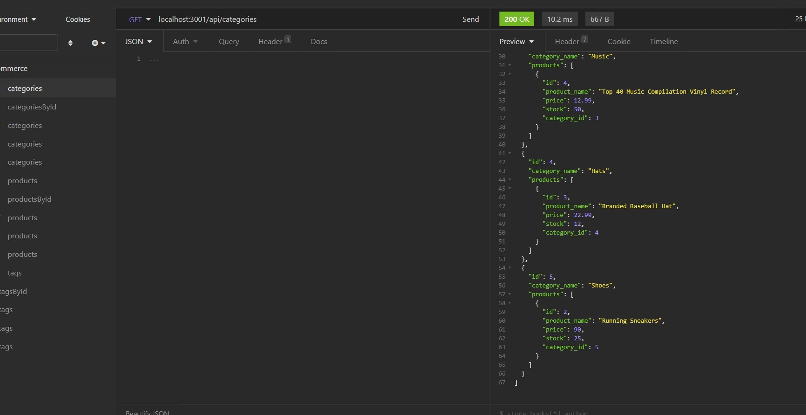
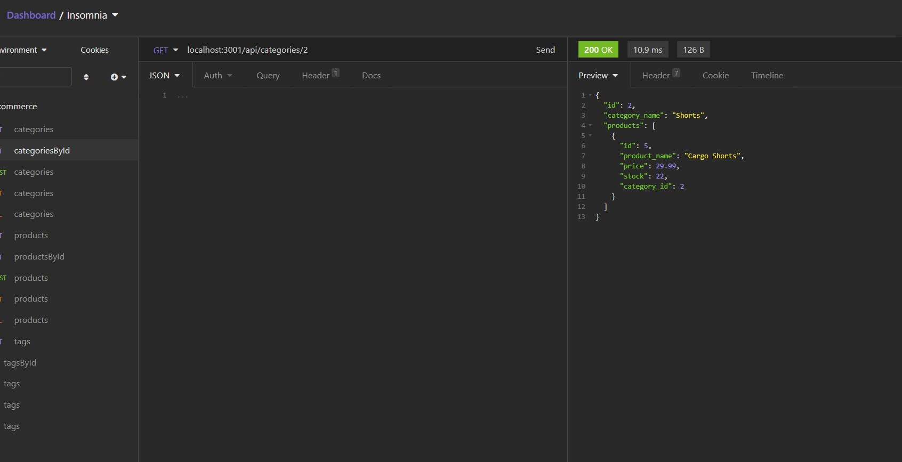
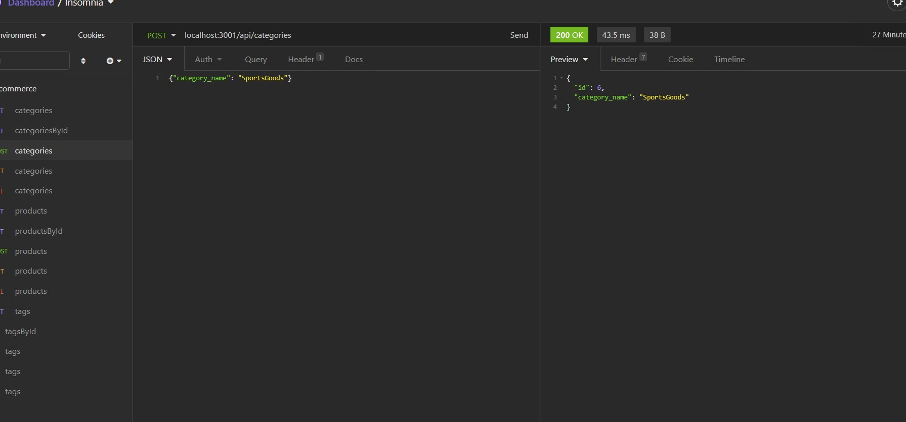
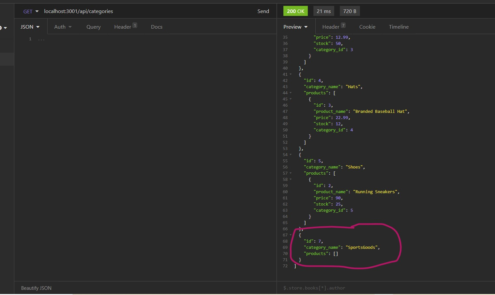
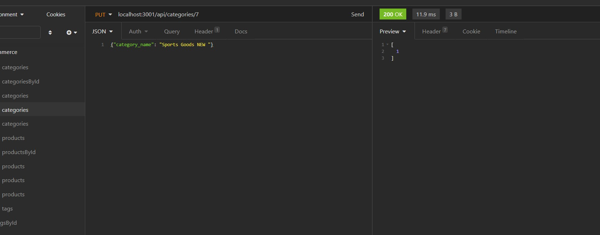
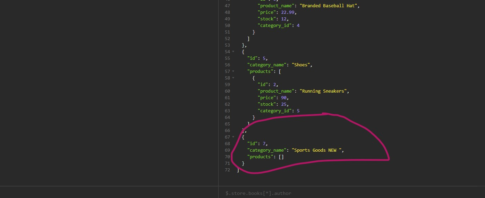
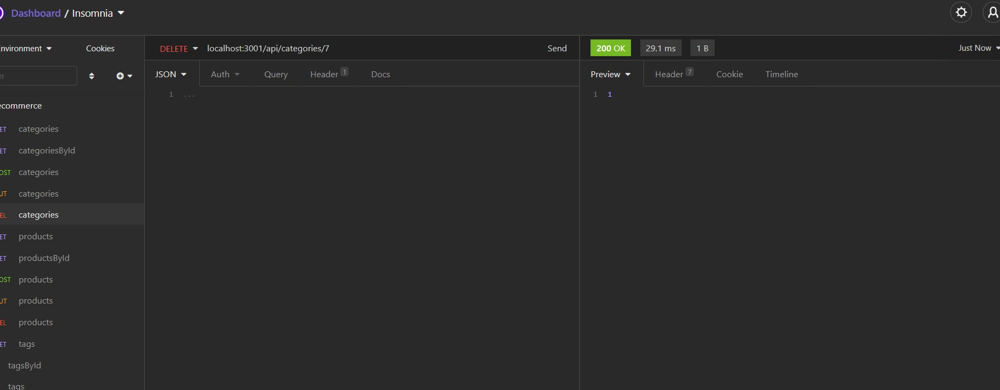
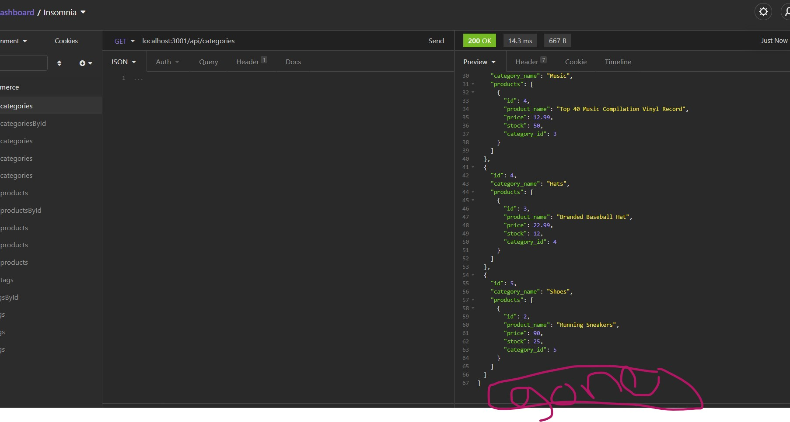

## E-Commerce-Back-End

## License
 [](https://opensource.org/licenses/MIT)


<!-- TABLE OF CONTENTS -->
<details open="open">
  <summary>Table of Contents</summary>
  <ul>
    <li>
      <ul>
        <li><a href="#User Story">User Story</a></li>
        <li><a href="#Acceptance Criteria">Acceptance Criteria</a></li>
          <li><a href="#Built With">Built With</a></li>
          <li><a href="#Deployed Links">Deployed Links</a></li>
         <li><a href="#Screenshot">Screenshot</a></li>
        <li><a href="#Contact">Contact</a></li>
      </ul>
    </li>
    </ul>
</details>


## User Story

AS A manager at an internet retail company
I WANT a back end for my e-commerce website that uses the latest technologies
SO THAT my company can compete with other e-commerce companies
``

## Acceptance Criteria

```md
GIVEN a functional Express.js API
WHEN I add my database name, MySQL username, and MySQL password to an environment variable file
THEN I am able to connect to a database using Sequelize
WHEN I enter schema and seed commands
THEN a development database is created and is seeded with test data
WHEN I enter the command to invoke the application
THEN my server is started and the Sequelize models are synced to the MySQL database
WHEN I open API GET routes in Insomnia Core for categories, products, or tags
THEN the data for each of these routes is displayed in a formatted JSON
WHEN I test API POST, PUT, and DELETE routes in Insomnia Core
THEN I am able to successfully create, update, and delete data in my database
```

## Built with
   * Mysql
   * JS
   * npm express
   * seqeulize
   * insomnia
   


## Deployed Links
[Video link](https://youtu.be/o519vmw1bNg)

[link github](https://github.com/shaimajobran/E-Commerce-Back-End)


## screenshot








## Contact
If you have any questions about the repo, contact me at [shaimajobran](https://github.com/shaimajobran).

